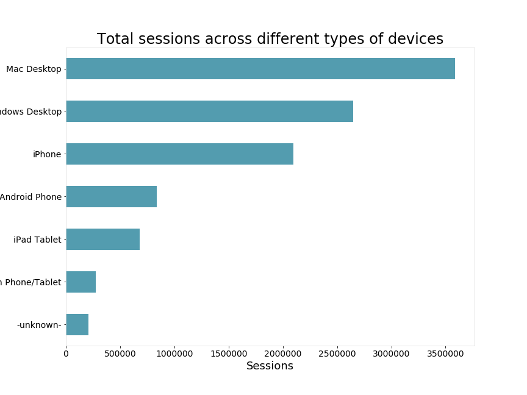
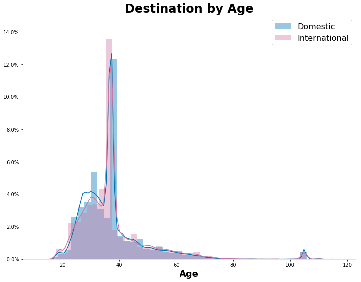
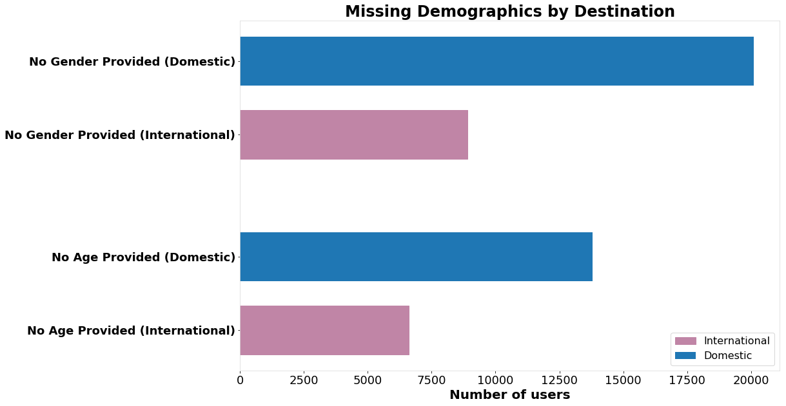
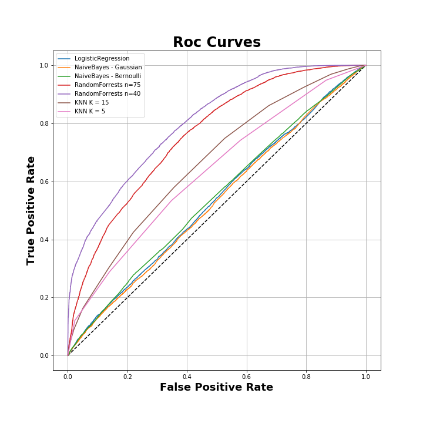
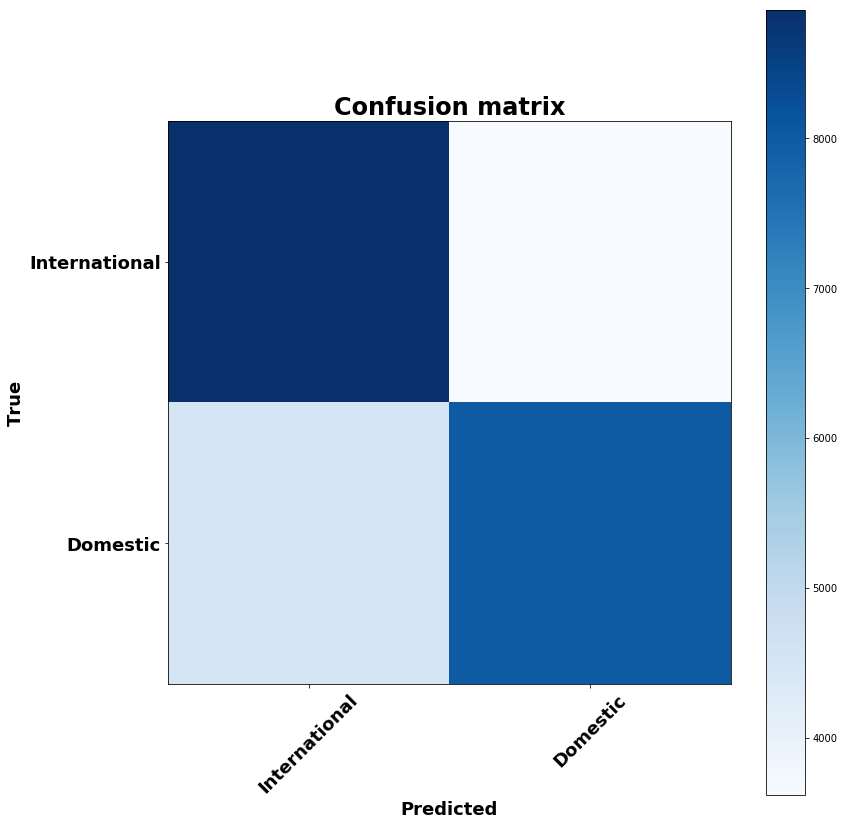
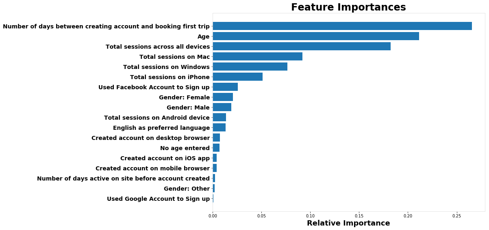
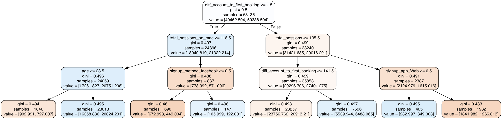
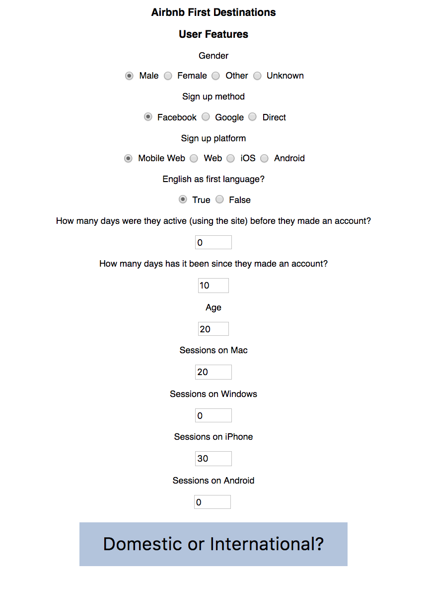
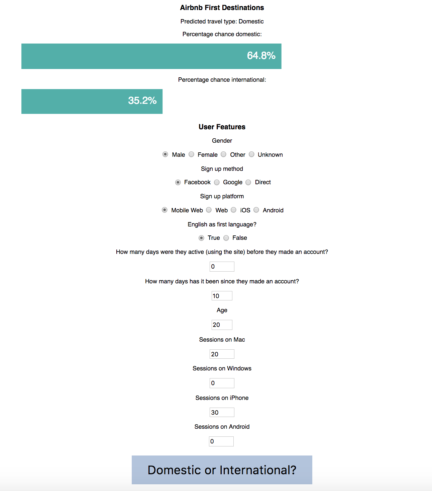
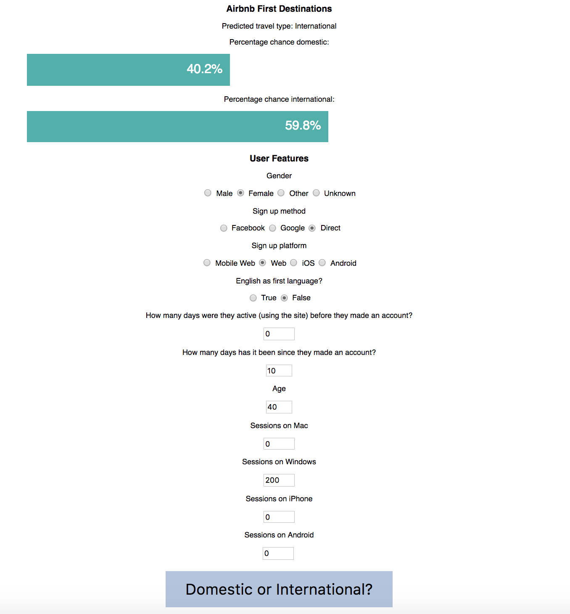

## Metis Project 3: Classification Modeling, SQL and Flask

Can we predict new Airbnb users' very first destinations using their demographics and browsing behavior?

## Motivation

Travel has always been a pretty big passion of mine, and I have some experience working with behaviourial data from digital systems, so for my classification project I decided to combine the two interests!  

In this post I'll walk through my approach and how I used classification techniques to find patterns in users' demographics and browsing behavior in order to inform whether their first trip with Airbnb will be have a Domestic or International destination.

## From Airbnb's perspective..

.. It'd be pretty cool to know where a new user is most likely looking to make their first booking - be it for accommodation or an experience.  If we had some insight into this (and Airbnb definitely does), we could more effectively personalize each user's experience by recommending experiences or accommodation based on where they're most likely looking.  Building an interactive model could allow product and/or marketing teams to build and experiment with different personas before releasing changes into production.

Or, in their words:

*'By accurately predicting where a new user will book their first travel experience, Airbnb can share more personalized content with their community, decrease the average time to first booking, and better forecast demand.'*

## Data Summary

The data I used for this project was provided by Airbnb to Kaggle for a competition that was run in 2014. It can be found [here](https://www.kaggle.com/c/airbnb-recruiting-new-user-bookings/data) and includes separate tables for:
- user demographics, 
- sessions (browsing behavior) data, 
- summary statistics for different destinations, and
- summary statistics for users' age group, gender and destination.

The two that I was most interested in incoroporated were the browsing behavior and demographics datasets.  The other two were mostly for exploratory analysis.

### Browsing Behavior
The Sessions data includes a record for every single time a user visited Airbnb's website or app. It describes what they did, what device they were on and how long they visited for. It doesn't include any dates or timestamps, which would have been cool to dig into.  Still, these features were enough to get started on in terms of behaviors.

### Demographics
The Demographics data includes information pertaining to each user like their gender, age and language preferences, as well as information describing how they signed up for airbnb, the date they created their account and the date they made their first booking. For descriptions on more features included, you can head over to the [Kaggle page](https://www.kaggle.com/c/airbnb-recruiting-new-user-bookings/data).

The demographics data needed some cleaning up. Ages ranged between 0 and 2014, which clearly had some issues.  I transformed any values for age that were actually year of birth to their corresponding age.  According to Airbnb's policies, users must be 18 in order to hold an acocunt, so I changed users with an age less than 18 to have the dataset's mean value for age.  I did the same for any users that claimed to be older than 120. 

## Feature Engineering and Exploration
I pushed both of these datasets into a PostgreSQL database for exploratory analysis and feature engineering.  

Since there could be many sessions for each user, I needed to do some aggregation to summarize behaviors.  There are a number of ways that behaviors could have been described using the data in the sessions class.  I decided to count the number of sessions for each user between the time that they made their account and when they made their first booking.  I also aggregated the number of sessions that each user spent across different types of devices.

||
|:--:|
|**Figure 1**: Distribution of sessions across devices |

When I was exploring the features in comparison to users' destinations, I noticed that a lot of features had very little separatation across classes. An example of this is shown in Figure 2, where I plot users' ages corresponding with their first destination.  The two distributions are almost entirely on top of each other, though if you look closely you'll see that older users are more likely to travel internationally on their first trip with Airbnb.

||
|:--:|
|**Figure 2**: Distributions of users' ages with respect to their first destination|

This was my first indication that modeling this might be a bit tricky!  

I also noticed that quite a few users were missing ages and genders.  It seems like Airbnb allows users to skip adding certain information to their profiles. Rather than getting rid of these, I created new features that marked each user as having a missing age or gender, so that I could see if leaving information out of your Airbnb gave any kind of indication on your first destination.

||
|:--:|
|**Figure 3**: Number of users missing certain gender and age information on their profiles, compared to their first destinations|

Looking at figure 3, there seems to be some correlation between missing information and domestic travellers! 

## Dealing with Imbalanced Classes

When I built a few models for some preliminary tests, I noticed pretty quickly that I had an imbalanced class problem. My dataset contained three times as many users who travelled Domestically on their first trip as those who travelled Internationally.  This makes sense intuitively, but this can cause some issues in classification modelling. 

I tried both upsampling and downsampling (with replacement), and found that upsampling improved my modeling efforts considerably. Resampling like this simulates a larger sample size, allowing models to gain stronger understanding of relationships between targets and minority classes.

## Model Comparison

Once I had my data ready, I started building a few models to compare.  These included Logistic Regression, Naive Bayes (both Bernoulli and Gaussian), K Nearest Neighbors, Support Vector Machines and Random Forest ensembles. I performed grid searches on these, and found the best fits for each.  A comparison of ROC Curves can be seen in Figure 4.

||
|:--:|
|**Figure 4**:  ROC Curves for each of my models|

ROC Curves plot each model's False Positve Rate against it's True Positive Rate.  In my models' case, this is the rate at which the model incorrectly classifies a users' destination, against the rate at which it classifies correctly. 

ROC Curves can be used to choose classification models by finding the area under each of the models' curves, and finding the maximum.  We want the area under the ROC curve to be as close to 1 as possible. In this case we can see that my Random Forest model is the winner.

This [video](http://www.dataschool.io/roc-curves-and-auc-explained/) explains how to analyze ROC Curves really clearly.

## The best fit: Random Forests

The model with the largest area under the ROC Curve for this problem was a Random Forest ensemble with 75 Decision Trees, with a maximum depth of 20.  This means it uses 75 trees to vote on whether the user will travel Domestically or Internationally, and each one can only ask 20 yes or no questions to come to a decision.

To get a feel for how the model works, we can look at a few different things:

### 1. Confusion Matrix

Confusion matrices (which can be confusing at first) show how a classifier is performing against out of sample test data.  Figure 5 shows the confusion matrix for my best model for this problem.  

Confusion matrices plot a model's predictions (in my case, Domestic or International destinations) against actual results. Ideally, a model's predictions should fall along the diagonal of it's confusion matrix, indicating that the predictions agree with the actual results.  For more information on confusion matrices and how to interpret them, have a look [here](http://www.dataschool.io/simple-guide-to-confusion-matrix-terminology/) or [here](http://www2.cs.uregina.ca/~dbd/cs831/notes/confusion_matrix/confusion_matrix.html).

Looking at Figure 5, you'll see that my model has found most of users with International destinations, but has trouble with those travelling Domestically.  So if we want to make sure that we find all users who are likely to travel internationally (and don't mind missclassifying Domestic travellers), this model will work ok.  

If we'd rather aim for more accurate classifications, we could apply a cost function that penalizes missclassfication.  This comes down to specific business strategies, which I didn't make any assumptions about in my project. I might look into playing around with applying different business logic and strategies in the future.

For now, the majority of the model's predictions sit along the diagonal more than any of the other models I tried.

||
|:--:|
|**Figure 5**: The Confusion Matrix for my highest performing model |

### 2. Feature Importances

The cool thing about using Random Forest ensembles for classification is that their features are inherently ranked in terms of their power to impact the model's decision.

Keep in mind, the rankings don't say whether a change in one of the features will result in an increase or decrease in probability.

Figure 6 shows the relative importance of the top features in my model.  Some notes on the top few features:

- It's interesting that the length of time between an account being made and a trip being booked has such a huge impact on the classification.  
- As we saw earlier, age has a correlation with destination, so there's no surprise it shows up here. It's interesting that it is one of the most important features, though, since the difference in ages between destinations is quite subtle. That indicates that the model is picking up on some subtle relationships.  This is a strength of Random Forests'!
- The browsing behavior features (total sessions and the sessions on different types of devices) show up as being pretty important!

||
|:--:|
|**Figure 6**: Relative importances of top features in Random Forest Enesmble|

The power of knowing the feature importances allows us to group users based on how they rate for the most important features.  Figure 6 shows that grouping people based on age, length of time since they made their account and how active they are would be more effective (in terms of predicting their destination) than whether they used a social media account for example.

### 3. Tree Diagram

The third way that we can interpret a Random Forest model is by inspecting one of it's trees.  

Random Forests are (as the name implies) a collection of randomly generated decision trees.  Features are fed into each of the trees, which in turn classify the user as being most likely to travel Domestically or Internationally.  The trees vote, and the majority destination wins!

The upshot of this is that choosing one of the decision trees at random is NOT a complete picture of the model.  It can, however, show us an example of how the model is splitting the features.

To see an example of this, have a look at Figure 7.  We can see the first question it asks is whether the users has had their account for less than one and a half days.  The rest of the questions relate to age, sessions and there's even one about how the user signed up.

||
|:--:|
|**Figure 7**: An example of a decision tree with a depth of 3.|

Remember! This is an example of a single decision tree with a maximum depth of 3! My model included 75 decision trees similar to this one, though their maximum depths were 20.

## Ok.. we have a model, but how do we use it?

I made a prototype of an app that predicts a user's destination given certain demographics and browsing behavior.  The app includes an api that passes the probability of a given user travelling Domestically or Internationally on their first trip, which could be used to personalize their recommendations, communications, or anything else that the business wanted!  I decided to create a frontend as well.

The app runs on Flask, and I used D3.js to draw the bars. 

||
|:--:|
|**Figure 8**: A screenshot of my app before making any predictions|

To demonstrate how the model classifies different types of people, I made two personas:

- **Persona #1** is a 20 year old male who signed up using his Facebook account on his mobile web browser. His preferred language is English, and he's had his account for 10 days.  He's spent 20 sessions on his Mac and 30 on his iPhone.
- **Persona #2** is a 40 year old female who created her account using a desktop browser without a social media account.  She prefers a language other than english, has held her account for 10 days and has spent all 200 of her sessions on Windows!

See Figures 9a and b for details on their predictions!

|||
|:--:|:--:|
|**Figure 9a**: Persona #1 | **Figure 9b**: Persona #2|

The app shows the overall classification, as well as the model's percentage of certainty of that prediction.

A couple of interesting tidbits I found from playing with the app:

- A high number of sessions on Windows seems to increase the probability of the user travelling internationally
- The longer the user has had their account before they make their first booking, (it seems) the more likely they'll be to book Domestically.
- High proportions of sessions on iPhones increase the probability that the user will travel Domestically.

## Next steps

I learned a lot from this project! If I have more time in the future (after the bootcamp perhaps?) I'd love to dig a bit deeper on this topic.  I'd like to:

- apply a cost function to the model as I suggested above in order to minimize incorrect classifications according to different business strategies,
- expand the model to predict regions or country destinations for each user, and
- work on engineering some more features from the sessions dataset.

For now, I've got to start thinking about my next project - Natural Language Processing with Unsupervised Learning techniques!

